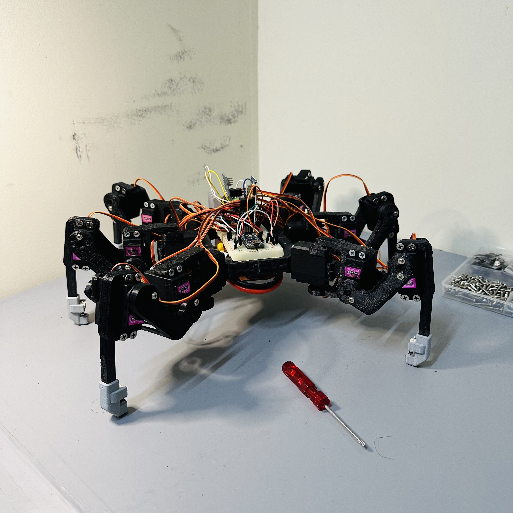

# HexaPod 🕷️

An autonomous six-legged robot. A **Raspberry Pi** runs the "brain" (inverse
kinematics, a tripod gait engine, IMU body-leveling, foot-contact terrain
adaptation, and ultrasonic obstacle avoidance) in Python; an **Arduino Mega**
runs the "spine" (firmware that drives 18 servos and reads the sensors). They
talk over a small, framed serial protocol.

**Goal:** walk autonomously with a proper tripod gait + inverse kinematics, keep
the body level on uneven ground with the IMU, sense foot touchdown with limit
switches, and stop-and-turn away from obstacles seen by the ultrasonic sensor.



Almost everything is runnable and testable on a laptop with **no hardware** via a
mock-Arduino serial loopback and per-module self-tests — see [Running offline](#running-offline).

---

## Hardware

| Role             | Part                        | Notes                                              |
| ---------------- | --------------------------- | -------------------------------------------------- |
| Brain            | Raspberry Pi (Python)       | IK, gait, perception, state machine, serial master |
| Motor controller | Arduino Mega (C++/Arduino)  | Serial slave: drives servos, reads sensors         |
| Servos           | 18× MG996R                  | 6 legs × 3 DOF (coxa, femur, tibia)                |
| Servo drivers    | 2× PCA9685 (I2C, 16-ch PWM) | 9 servos per board                                 |
| Foot contact     | 6× limit switch             | one under each leg — detects touchdown / stance    |
| Distance         | 1× HC-SR04 ultrasonic       | front-facing, for obstacle avoidance               |
| Orientation      | 1× MPU6050 IMU              | accel + gyro → roll/pitch for body leveling        |
| Link             | USB serial (Pi ↔ Mega)      | Pi sends 18 servo targets/tick; Mega streams sensors |

Each leg has **3 DOF**: `coxa` (horizontal yaw) → `femur` (thigh lift) →
`tibia` (knee) → foot.

---

## Architecture

```
            RASPBERRY PI  (brain, Python, ~50 Hz)                      ARDUINO MEGA (spine)
 ┌─────────────────────────────────────────────────────┐         ┌──────────────────────────┐
 teleop / autonomy                                                │  parse servo frame       │
   │                                                              │     ▼                    │
   ▼                                                  18 servo     │  2× PCA9685 ──▶ 18 servos │
 state machine ──▶ velocity commander (ramp) ──▶ control loop ───────────────────▶            │
   ▲   IDLE/STAND/WALK/AVOID                            │  pulses  │                          │
   │                                  gait engine ──▶ contact ──▶  │  HC-SR04  ─┐             │
   │                                  (tripod +      adaptation    │  MPU6050  ─┼─▶ telemetry │
   │                                   trajectory)      │          │  6× switch ┘     ▲       │
   │                                                 leveling ──▶ IK ──▶ servo map    │       │
   │                                                    │             (calibration)   │       │
 obstacle detector ◀── perception ◀── telemetry ◀───────────────────────────────────┘       │
   │                                          (distance, roll/pitch, 6 contacts)              │
 leveling ◀────────────────────────────────────────────┘         └──────────────────────────┘
```

The Pi decides **where each foot should be**; the Mega makes it happen and
reports **what the body is feeling**. The split is deliberate: the Pi has the
floating-point math and easy debugging for IK/gait; the Mega + PCA9685 gives
rock-steady hardware PWM and tight sensor timing the Pi's OS can't guarantee.

### Control pipeline, per 20 ms tick
1. **State machine** picks the behavior (IDLE / STAND / WALK / AVOID) from intent + the obstacle flag.
2. **Velocity commander** ramps the chosen command (no lurching).
3. **Gait engine** turns `(vx, vy, ω)` into 6 foot targets (tripod scheduler + swing/stance trajectory).
4. **Contact adaptation** nudges each foot's reach to follow the real ground (limit switches).
5. **Leveling** counter-tilts the body pose from the IMU.
6. **Body kinematics + IK** convert foot targets → 18 joint angles.
7. **Servo map** applies per-servo calibration → 18 µs pulses → serial → Arduino.

---

## Repository layout

```
HexaPod/
├── pi/                          # Raspberry Pi brain (Python)
│   ├── config.py                #   robot geometry, joint limits, stance, rate
│   ├── math_utils.py            #   Vec3, angle helpers, rotations
│   ├── main.py                  #   entry point: config + teleop + run loop
│   ├── kinematics/
│   │   ├── leg_ik.py            #   3-DOF single-leg inverse kinematics  ← core
│   │   ├── leg_fk.py            #   forward kinematics (verifies the IK)
│   │   └── body.py              #   body pose → per-leg foot targets
│   ├── comms/
│   │   ├── protocol.py          #   serial frame format + CRC + parser
│   │   ├── servo_map.py         #   joint angles → PCA9685 pulses (calibration)
│   │   └── serial_link.py       #   serial I/O + in-memory mock Arduino
│   ├── gait/
│   │   ├── trajectory.py        #   per-foot swing/stance path
│   │   ├── tripod.py            #   tripod phase scheduler
│   │   └── engine.py            #   velocity → 6 foot targets
│   ├── control/
│   │   ├── loop.py              #   fixed-rate control tick
│   │   ├── commander.py         #   velocity limits + acceleration ramping
│   │   ├── standup.py           #   smooth stand-up / sit-down sequences
│   │   ├── leveling.py          #   IMU body-leveling controller
│   │   ├── contact.py           #   foot-contact terrain adaptation
│   │   ├── state_machine.py     #   IDLE / STAND / WALK / AVOID
│   │   └── avoidance.py         #   stop-and-turn maneuver
│   └── perception/
│       └── obstacle.py          #   filtered ultrasonic + obstacle flag
├── arduino/hexapod/
│   ├── hexapod.ino              #   Mega firmware (servos, sensors, telemetry)
│   └── protocol.h               #   C mirror of the serial protocol
├── tests/test_kinematics.py     #   IK/FK round-trip sweep (pytest)
├── hexapod.yaml                 #   runtime tuning config
├── requirements.txt             #   Pi Python deps
└── conftest.py                  #   makes `pi` importable in tests
```

---

## Serial protocol

Framed binary, little-endian, with a CRC-8 (poly `0x07`). Defined once in
[`pi/comms/protocol.py`](pi/comms/protocol.py) and mirrored in
[`arduino/hexapod/protocol.h`](arduino/hexapod/protocol.h).

```
Frame:  [0xAA][0x55][TYPE][LEN][PAYLOAD ...][CRC8]
        sync bytes    1     1     LEN bytes    1     (CRC covers TYPE..PAYLOAD)
```

| Message       | Dir         | Payload                                                              |
| ------------- | ----------- | ------------------------------------------------------------------- |
| SERVO (0x01)  | Pi → Mega   | 18 × `uint16` µs pulses, in global servo order (`leg*3 + joint`)     |
| TELEMETRY (0x02) | Mega → Pi | `uint16` distance_mm · `int16` roll_cdeg · `int16` pitch_cdeg · `uint8` contacts |

Servo index → board/channel: `board = index // 9`, `channel = index % 9`.
`distance_mm = 0xFFFF` means "no echo". `contacts` bit *i* = leg *i* planted.

---

## Wiring summary

| Connection            | Detail                                                                  |
| --------------------- | ----------------------------------------------------------------------- |
| Pi ↔ Mega             | USB serial, 115200 baud                                                  |
| I2C bus (Mega)        | SDA = pin 20, SCL = pin 21 — shared by both PCA9685s and the MPU6050     |
| PCA9685 #0            | I2C `0x40` (no jumpers) → legs L1, L2, L3 (servo indices 0–8)            |
| PCA9685 #1            | I2C `0x41` (A0 bridged) → legs R1, R2, R3 (servo indices 9–17)           |
| HC-SR04               | TRIG = pin 7, ECHO = pin 2 (**interrupt-capable**; not the I2C pins)     |
| MPU6050               | I2C `0x68` on the shared bus                                             |
| Foot switches         | pins 30–35, each switch wired pin→GND (internal pull-ups; pressed = LOW) |
| Servo power           | PCA9685 V+ from a **separate 5–6 V / ≥10 A** supply                       |
| **Grounds**           | **Mega GND, both PCA9685 GND, and the servo-supply GND must be common**  |

> The #1 wiring mistake is a missing common ground between the servo supply and
> the logic — the PWM signals then have no shared reference and servos jitter or
> don't respond.

---

## Build & run

### Raspberry Pi (or laptop)
```bash
python -m pip install -r requirements.txt
python -m pi.main                 # auto-loads ./hexapod.yaml (mock if no port set)
python -m pi.main --port /dev/ttyACM0   # talk to a real Arduino
python -m pi.main --mock          # force the offline fake Arduino
```
Teleop keys: `w`/`s` forward/back · `a`/`d` strafe · `q`/`e` turn · `space` stop ·
`u` stand up · `j` sit down · `o` (mock) toggle a fake obstacle · `x` quit.

### Arduino Mega
Install the libraries (Arduino IDE Library Manager or `arduino-cli lib install`):
`Adafruit PWM Servo Driver Library`, `Adafruit MPU6050`, `Adafruit Unified Sensor`.
```bash
arduino-cli compile --fqbn arduino:avr:mega arduino/hexapod
arduino-cli upload  --fqbn arduino:avr:mega -p <PORT> arduino/hexapod
```
On boot the LED blinks at 2 Hz and all servos centre (staggered to avoid an
inrush brown-out). The Pi commands the real stance once connected.

### Running offline
No hardware needed. Every module has a self-test, and the comms/control stack
runs against an in-memory fake Arduino:
```bash
python -m pytest                  # IK/FK round-trip sweep (447 cases)
python -m pi.kinematics.leg_ik    # any module: `python -m pi.<module>` runs its self-test
python -m pi.control.loop         # "walks" the robot against the mock Arduino
python -m pi.main --selftest      # full integrated stack, headless
```

---

## Tuning notes

All tuning lives in [`hexapod.yaml`](hexapod.yaml) (runtime) and
[`pi/config.py`](pi/config.py) (physical geometry). Start here:

1. **Leg geometry** (`pi/config.py`): caliper `coxa/femur/tibia` lengths and the
   leg mount positions/yaws. Everything downstream depends on these.
2. **Servo calibration** (`pi/comms/servo_map.py`): per-servo `neutral_us`,
   `direction` (±1, left vs. right are mirror images), and `trim_deg`. Set each
   so commanding joint angle 0 puts the leg at its true geometric zero.
3. **Leveling sign** (`leveling.sign`): if the body leans *into* a slope instead
   of leveling, flip it. (Absolute IMU polarity is mounting-dependent.)
4. **Gait feel** (`gait.*`, `velocity.*`): `period_s` and `step_height_mm` set
   cadence and ground clearance; `max_step_mm` caps the stride; the `velocity`
   accelerations set how snappy teleop feels.
5. **Obstacle distances** (`obstacle.*`): `threshold_mm` is the stop distance;
   `clear_margin_mm` is the hysteresis band (make it bigger than the sensor's
   noise so the flag doesn't chatter).

---

## Design notes worth knowing

- **One IK function for all six legs.** Each foot target is expressed in its own
  *leg frame*; the per-leg mounting (position + yaw) is captured in the body
  kinematics, so [`leg_ik.solve`](pi/kinematics/leg_ik.py) is reused everywhere.
- **IK never throws.** Out-of-reach targets degrade to the nearest straight-leg
  pose rather than raising — a control loop must never crash mid-step.
- **The gait is decoupled from direction.** The tripod scheduler only does
  timing; *which way* the robot walks lives entirely in the step vector
  (`v_point = v_linear + ω × r`), so forward/strafe/turn all reuse one path.
- **Everything non-blocking on the Mega.** Sonar uses an interrupt-timed echo
  (not blocking `pulseIn`), the IMU/switches/telemetry are millis-scheduled, so
  the firmware sustains 50 Hz two-way comms while servicing four sensors.
- **Two feedback loops, both verified in simulation.** IMU leveling (an integral
  controller that parks tilt at zero) and foot-contact adaptation (per-leg ground
  probing) — both checked against modeled plants since they need hardware to test live.

---

## What I'd improve next

- **Closed-loop slip/odometry.** Use stance-phase foot motion + IMU to estimate
  body velocity and correct drift, instead of trusting the open-loop command.
- **Smoother swing.** Replace the half-sine lift with a cycloid for zero-velocity
  touchdown, and shorten the remaining swing on an early contact.
- **Better avoidance.** A single front sonar can't choose the clearer side — add
  side sensors (or a small servo sweep) to turn toward open space, not a default.
- **A proper attitude filter.** Swap the complementary filter for a Madgwick/EKF
  to get drift-free yaw and cleaner tilt under heavy leg motion.
- **Failsafe + watchdog.** Relax or hold pose if the Pi stops sending (the Mega
  already timestamps the last command — `lastCommandMs` — but doesn't act yet).
- **Gait variety.** Add wave/ripple gaits (higher duty factor) for slow,
  extra-stable walking over rough terrain, selectable at runtime.
- **A simulator/visualizer.** `joint_positions()` already gives the full leg
  geometry; a matplotlib/3D view would make gait tuning far faster than hardware.
